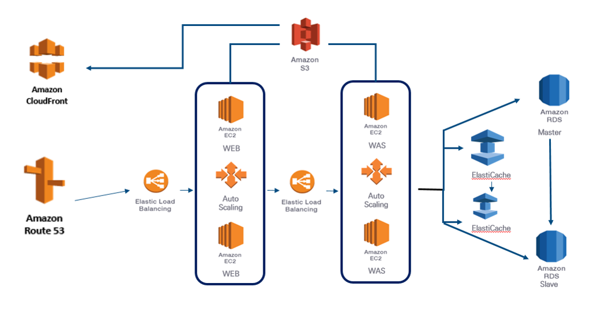

# Hello_World
헬로우 월드입니다.
markdown language를 쓴다.
나무위키, 위키피디아
# 개발자 소개
# 작품1
### 설계도

### 발표자료
[최종발표자료].(/project.pptx)
### 시연동영상
<iframe width="500" height="300" src="https://www.youtube.com/embed/_WQR6-sqqjM" title="백엔드 개발 이 영상만 보셔도 거의" frameborder="0" allow="accelerometer; autoplay; clipboard-write; encrypted-media; gyroscope; picture-in-picture; web-share" referrerpolicy="strict-origin-when-cross-origin" allowfullscreen></iframe>
### reference
[네이버](https://www.naver.com)
[구글](https://www.google.com)
# 사진
동영상
link 생성
